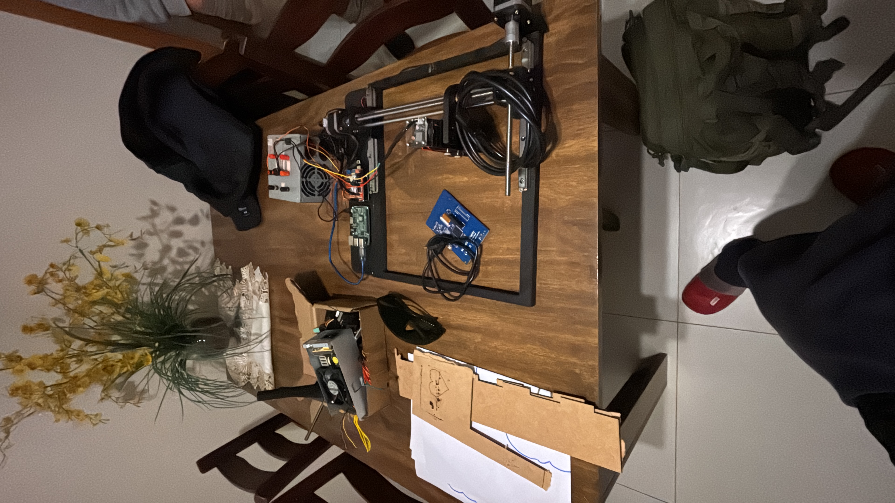
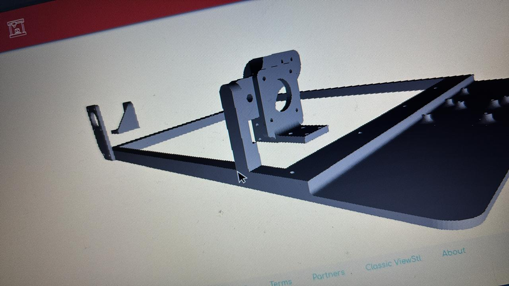
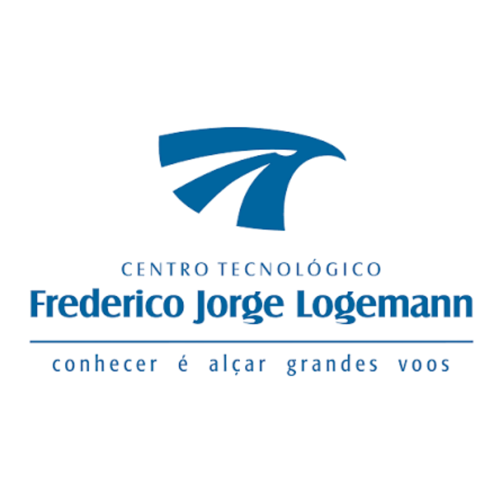

# Gravadora a Laser de Arquitetura Aberta

 

  <b>Desenvolvido por Arthur Emanuel Forster, Vicenzo Beskow Hemmilã e Vitor Reimann Balsan</b>  

  Orientação: Profª. Giovana Freitas da Silva  

  <b>Centro Tecnológico Frederico Jorge Logemann (CFJL) — Horizontina/RS</b>

---

## 📋 Sobre o Projeto

Este repositório documenta o desenvolvimento de uma **Gravadora a Laser de Arquitetura Aberta**, projeto apresentado na feira **Escola Aberta do CFJL (2026)**. O objetivo principal do projeto consiste em superar as limitações impostas pelos sistemas industriais tradicionais e proprietários — frequentemente comercializados como "caixas pretas" rígidas, fechadas e de alto custo de manutenção [1].

Através da adoção de uma estrutura modular e de código/hardware abertos, a máquina desenvolvida oferece total liberdade para modificações mecânicas, personalização de software e implementação de sistemas de automação avançados.

---

## 🛠️ Principais Diferenciais e Características

A proposta do equipamento baseia-se em quatro pilares fundamentais que garantem versatilidade, inovação e autonomia ao operador:

- **Arquitetura Aberta:** Diferente dos equipamentos comerciais convencionais, toda a estrutura mecânica, eletrônica e o código de controle são totalmente acessíveis, permitindo que o usuário personalize e expanda as capacidades da máquina conforme a necessidade específica de sua aplicação.

- **Customização Modular:** Possibilidade de substituição simplificada de componentes, troca de módulos de laser e redimensionamento da área de trabalho.

- **Controle e Automação:** Integração de eletrônica programável e sistemas de controle dedicados para assegurar alta precisão e repetibilidade em processos de corte e gravação.

- **Multidisciplinaridade e Inovação:** O projeto une conceitos de engenharia mecânica, eletrônica, design assistido por computador (CAD) e programação, servindo como uma alternativa dinâmica e acessível para o setor produtivo.

---

## 📂 Estrutura do Repositório

O repositório está organizado da seguinte forma para facilitar a consulta por avaliadores, pesquisadores e entusiastas:

| Pasta / Arquivo | Descrição |
| --- | --- |
| `imagens/` | Contém registros visuais do projeto, incluindo a máquina montada (`laser-pronta.JPG`), esquemáticos e o logotipo institucional (`CFJL.png`). |
| `Diario de bordo escola aberta.pdf` | Registro cronológico detalhado de todas as etapas de desenvolvimento, reuniões e testes práticos do grupo. |
| `Plano de Pesquisa Gravadora a laser.pdf` | Documento inicial delineando o problema de pesquisa, justificativa, objetivos e metodologia planejada. |
| `Relatorio gravadora.pdf` | Relatório de pesquisa completo contendo a fundamentação teórica, revisão bibliográfica, descrição dos componentes e resultados obtidos. |
| `Laser.stl` | Arquivo em formato STL contendo o modelo 3D de peças estruturais e suportes desenvolvidos para a fabricação aditiva. |

---

## 🖼️ Galeria do Projeto

  

---

## 👥 Equipe e Contato

- **Arthur Emanuel Forster** — `af007672@cfjl.com.br` | (55) 99172-5284

- **Vicenzo Beskow Hemmilã** — `vb007661@cfjl.com.br` | (55) 99731-3541

- **Vitor Reimann Balsan** — `vh007644@cfjl.com.br` | (55) 99928-3848

---

## 📜 Licença

Este projeto é desenvolvido sob os princípios de código aberto e compartilhamento de conhecimento técnico. Consulte os arquivos de relatório e plano de pesquisa para maiores detalhes sobre especificações técnicas e metodologias aplicadas.
